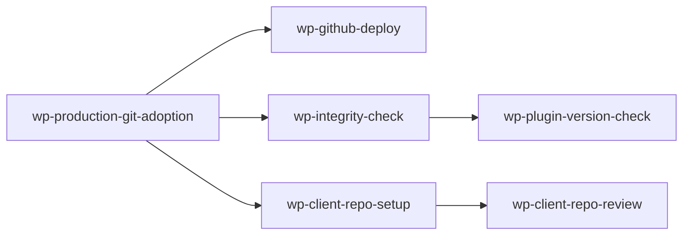

# Agent Skills

A shared repository of AI agent skills for use across projects. Skills teach AI assistants (Claude Code, Cursor, etc.) domain-specific procedures for common tasks.

## Structure

```text
skills/                    — Custom skills authored here
vendor/                    — External skills (submodules and single-file copies)
  wordpress/               — https://github.com/WordPress/agent-skills (submodule, branch: trunk)
  jdevalk/                 — https://github.com/jdevalk/skills (submodule, branch: main)
  specification-website/   — single SKILL.md copied from https://github.com/jdevalk/specification.website
```

## Skill Format

Each skill lives in its own directory with a `SKILL.md` file using YAML frontmatter:

```yaml
---
name: skill-name
description: "What this skill does (concise, used for routing)"
compatibility: "Target platform and version constraints"
---
```

Followed by these sections (in order):

1. **When to use** — trigger conditions
2. **Inputs required** — what to gather before starting
3. **Procedure** — step-by-step checklist
4. **Verification** — how to confirm success
5. **Failure modes** — common gotchas
6. **Escalation** — when to ask for help

Optionally include a `references/` subdirectory for deeper documentation and a `scripts/` subdirectory for deterministic helper scripts.

## Skills

### Custom skills (`skills/`)

The **Upstream** column shows live package versions. Compare against the **Written against** column to spot skills that may need refreshing. See each skill's `metadata.written_against` frontmatter for the full version map. Skills marked _static_ have no public release API.

| Skill                                                              | Description                                                                                                                                                                                                                                            | Written against                                                             | Upstream (live)                                                                                                                                                                                                                                                                                                                                                                                                                                                                                                                                                                                                                                                                                                                                                |
| ------------------------------------------------------------------ | ------------------------------------------------------------------------------------------------------------------------------------------------------------------------------------------------------------------------------------------------------ | --------------------------------------------------------------------------- | -------------------------------------------------------------------------------------------------------------------------------------------------------------------------------------------------------------------------------------------------------------------------------------------------------------------------------------------------------------------------------------------------------------------------------------------------------------------------------------------------------------------------------------------------------------------------------------------------------------------------------------------------------------------------------------------------------------------------------------------------------------- |
| [github-cli](skills/github-cli/)                                   | Use the `gh` CLI to manage GitHub PRs, issues, repos, releases, and Actions from the terminal. Includes JSON/jq scripting patterns and `gh api` usage.                                                                                                 | 2026-05-07<br>`gh 2.92.0`                                                   | [](https://github.com/cli/cli/releases)                                                                                                                                                                                                                                                                                                                                                                                                                                                                                                                                                                                                                                       |
| [skill-freshness-remediation](skills/skill-freshness-remediation/) | Remediate skill freshness issues, update `written_against` after upstream drift, and preserve still-relevant older-version guidance instead of overwriting it with latest-only instructions.                                                           | 2026-05-22<br>`gh 2.92.0`                                                   | [](https://github.com/cli/cli/releases)                                                                                                                                                                                                                                                                                                                                                                                                                                                                                                                                                                                                                                       |
| [terminus-wp-cli](skills/terminus-wp-cli/)                         | Run WP-CLI commands on Pantheon environments via Terminus. Covers installation, authentication, environment targeting, common commands, and Pantheon-specific cache/session commands.                                                                  | 2026-05-22<br>`terminus 4.2.2` · `wp-cli 2.12.0`                            | [](https://github.com/pantheon-systems/terminus/releases) [](https://github.com/wp-cli/wp-cli/releases)                                                                                                                                                                                                                                                                                                                                                                                                                                          |
| [wp-client-repo-setup](skills/wp-client-repo-setup/)               | Adopt an existing WordPress client repo and add minimal Composer or NPM tooling for WPCS/PHPCS, PHP compatibility, and `@wordpress/scripts`.                                                                                                           | 2026-05-22<br>`WP 7.0` · `phpcs 3.7.2` · `wpcs 3.3.0` · `wp-scripts 32.2.0` | [](https://wordpress.org/news/category/releases/) [](https://github.com/squizlabs/PHP_CodeSniffer/releases) [](https://github.com/WordPress/WordPress-Coding-Standards/releases) [](https://www.npmjs.com/package/@wordpress/scripts) |
| [wp-client-repo-review](skills/wp-client-repo-review/)             | Review an existing WordPress client repo for security issues, best-practice risks, and actionable follow-up after or alongside linting.                                                                                                                | 2026-05-22<br>`WP 7.0` · `phpcs 3.7.2` · `wpcs 3.3.0`                       | [](https://wordpress.org/news/category/releases/) [](https://github.com/squizlabs/PHP_CodeSniffer/releases) [](https://github.com/WordPress/WordPress-Coding-Standards/releases)                                                                                                                                                       |
| [wp-admin-ui](skills/wp-admin-ui/)                                 | Build or extend WordPress admin screens: legacy PHP/CSS patterns vs. React/DataViews, admin color scheme variables, mounting React in wp-admin, and SCSS design tokens.                                                                                | 2026-05-22<br>`WP 7.0` · `wp-components 33.1.0`                             | [](https://wordpress.org/news/category/releases/) [](https://www.npmjs.com/package/@wordpress/components)                                                                                                                                                                                                                                                                                                                                               |
| [local-wp-db](skills/local-wp-db/)                                 | Query the database of a WordPress site running under Local by WPEngine on macOS via the site-specific Unix socket.                                                                                                                                     | 2026-05-22<br>`Local 6.x` · `MySQL 8.0`                                     | [](https://localwp.com) [](https://dev.mysql.com/downloads/mysql/) _static_                                                                                                                                                                                                                                                                                                                                                                                                                                                                                                                    |
| [wp-production-git-adoption](skills/wp-production-git-adoption/)   | Connect an existing WordPress production site to a GitHub repo for the first time, or re-align a diverged local snapshot. Covers remote detection, git root patterns, safe index alignment, PLUGINS.md inventory, ignore rules, and divergence review. | 2026-05-29<br>`git 2.49.0` · `gh 2.92.0` · `wp-cli 2.11.0`                  | [](https://github.com/git/git/releases) [](https://github.com/cli/cli/releases) [](https://github.com/wp-cli/wp-cli/releases)                                                                                                                                                                                                                                                                                                                                                               |
| [wp-github-deploy](skills/wp-github-deploy/)                       | Set up GitHub Actions deployment workflows and drift detection for WordPress sites. Covers Kinsta, WP Engine, Pantheon, Pressable, and generic SSH/rsync hosts.                                                                                        | 2026-05-29<br>`gh 2.92.0` · `actions/checkout v4` · `ssh-agent v0.9`        | [](https://github.com/cli/cli/releases) [](https://github.com/actions/checkout/releases) [](https://github.com/webfactory/ssh-agent/releases)                                                                                                                                                                                                                                                                                                               |
| [wp-integrity-check](skills/wp-integrity-check/)                   | Audit a WordPress site's plugins, themes, and core for unexpected modifications. Verifies wp.org code via checksums, compares GitHub-hosted plugins against upstream tags, and baselines premium plugins for future drift detection.                   | 2026-05-29<br>`wp-cli 2.11.0` · `gh 2.92.0`                                 | [](https://github.com/wp-cli/wp-cli/releases) [](https://github.com/cli/cli/releases)                                                                                                                                                                                                                                                                                                                                                                                                                                                                                          |
| [wp-plugin-version-check](skills/wp-plugin-version-check/)         | Automated plugin version tracking via a scheduled GitHub Actions workflow. Compares installed versions against wp.org, GitHub releases, and premium vendor APIs (EDD, ACF, TGM), then opens a PR updating PLUGINS.md when versions change.             | 2026-05-29<br>`wp-cli 2.11.0` · `check-jsonschema 0.29`                     | [](https://github.com/wp-cli/wp-cli/releases) [](https://pypi.org/project/check-jsonschema/)                                                                                                                                                                                                                                                                                                                                                                                                                                                        |

### WordPress site lifecycle

These custom skills form a connected workflow for managing a client WordPress site end-to-end:



### WordPress skills (`vendor/wordpress/`)

Upstream skills from [WordPress/agent-skills](https://github.com/WordPress/agent-skills). See that repo's README for the full list.

### jdevalk skills (`vendor/jdevalk/`)

Skills from [jdevalk/skills](https://github.com/jdevalk/skills). Covers GitHub presence auditing, WordPress/Astro/EmDash CI/CD, WordPress.org plugin page optimisation, static-site SEO, readability checking, and static WordPress cloning. See that repo's README for the full list.

### specification-website (`vendor/specification-website/`)

A single `SKILL.md` copied from [jdevalk/specification.website](https://github.com/jdevalk/specification.website) at `public/.well-known/agent-skills/specification-website/SKILL.md`. The source repo is a website, not a skills collection, so only the skill file is vendored rather than adding a full submodule.

To update: re-run the fetch command and commit the result.

```bash
gh api repos/jdevalk/specification.website/contents/public/.well-known/agent-skills/specification-website/SKILL.md \
  --jq '.content' | base64 -d > vendor/specification-website/SKILL.md
```

---

## Installing Skills

Use the WordPress agent-skills build tooling to install skills into a project:

```bash
# Install WordPress skills globally
cd vendor/wordpress
node shared/scripts/skillpack-install.mjs --global --targets=claude

# Install to a specific project
node shared/scripts/skillpack-install.mjs --dest=../../your-project --targets=claude
```

For custom skills in `skills/`, either copy the skill directory into a target project's `.claude/skills/` directory or symlink the individual skill directory into `~/.claude/skills/` for global availability across projects.

## Adding External Skill Collections

```bash
git submodule add <repo-url> vendor/<name>
git submodule update --init --recursive
```

## Cloning This Repository

```bash
git clone --recurse-submodules <repo-url>
# or, after a plain clone:
git submodule update --init --recursive
```

## Validating skills

Run the upstream eval harness to check skills against the expected format:

```bash
node vendor/wordpress/eval/harness/run.mjs
```

This validates frontmatter completeness, required section order, and other structural rules defined in the WordPress agent-skills eval suite.

## Markdown Tooling

This repo uses [Prettier](https://prettier.io/) for formatting and [`markdownlint-cli2`](https://github.com/DavidAnson/markdownlint-cli2) for Markdown-specific linting.

Prettier is configured to prefer tabs with a tab width of 4 where the target format supports tabs. YAML indentation remains spaces because YAML does not allow tabs for indentation.

```bash
npm install
npm run lint
```

Available scripts:

- `npm run format` formats supported files with Prettier
- `npm run format:check` checks formatting without writing changes
- `npm run lint:md` runs Markdown lint checks only
- `npm run lint` runs formatting checks plus Markdown linting

Installing dependencies also sets up a `pre-commit` hook via `simple-git-hooks`, which runs `lint-staged` on staged Markdown, JSON, and YAML files.
